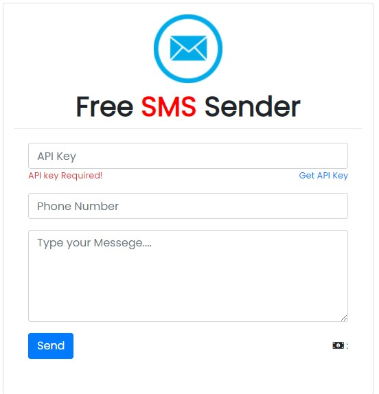

# About :  
<center>

</center>

Sms Sender is a web application for send sms to anyone for free. For send a sms you must need a API Key. Follow this documentation for all.

## Feature
    1. Send Sms For Free
    2. No need Sender Number
    3. Only need Reciver Number
    4. Only first time need API KEY
    5. No one can't track you
    6. No one can't reply to you

## How to use
1. Copy ```API KEY``` & Paste in Api key input field
2. Enter a reciver number
3. Type your messege. 
4. Click send button to send sms

## API KEYS  
* ```00V2A7BaR0t5zqh9dGJIKZEKOV8O1zHQRDyJT7kz```
* ```o9JqB6gfXswm3cL0K3S5w0c0qpC9d13lF6shAkMi```
* ```aPzY3td9CTd4nYk1w3XUT7tW1hJjFCOlMg1SzDwm```
* ```Zp44c1Fl09RbI6mSppFZ50X41fqjimfR3H9WhE2a```  

